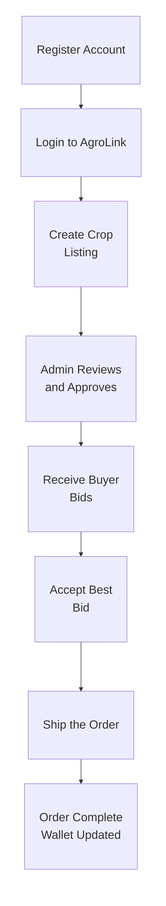
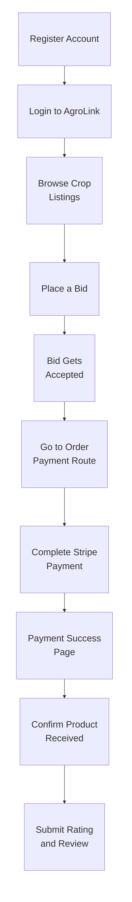
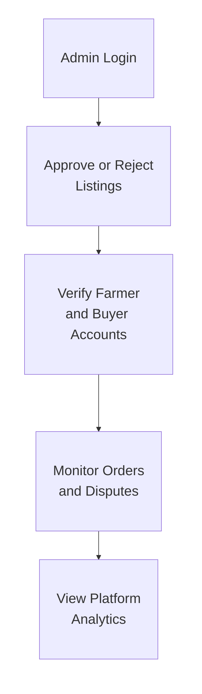
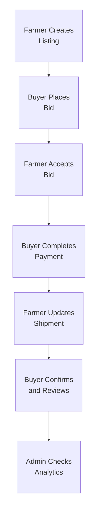

# AgroLink Frontend

AgroLink is a role-based agriculture marketplace where farmers create crop listings, buyers place bids, and orders are handled with secure payments and review workflows.

## Live Links

- Frontend Live URL: `Add your deployed frontend URL`
- Backend Live URL: `Add your deployed backend URL`

## Features

- Modern responsive homepage with multiple sections (Hero, Features, Category, CTA, Footer)
- Authentication flow (login/register) with Better Auth session handling
- Role-based dashboards:
  - Farmer: manage listings, bids, orders, wallet
  - Buyer: browse listings, place bids, pay and track orders
  - Admin: manage users, listings, orders and analytics
- Listing management with image uploads and category-based filtering
- Bid flow with accept/reject actions and listing close behavior
- Stripe payment integration for order payments
- Review and rating support after completed orders
- Loading states, toast notifications, and form validation with Zod + React Hook Form

## End-to-End Role Flows

### Farmer Flow



### Buyer Flow



### Admin Flow



### Quick Demo Sequence (for presentation)



## Tech Stack

- Next.js (App Router)
- React
- TypeScript
- Tailwind CSS
- Axios
- Better Auth (client-side integration)
- Stripe.js
- Zod + React Hook Form

## Project Structure

```text
src/
	app/                 # App Router pages and layouts
	components/          # Reusable UI and feature components
	hooks/               # Custom React hooks
	lib/                 # API/auth/stripe helpers
	types/               # Shared TypeScript types
```

## Environment Variables

Create a `.env.local` file in the frontend root and set:

```env
NEXT_PUBLIC_API_URL=http://localhost:5000
NEXT_PUBLIC_APP_URL=http://localhost:3000
NEXT_PUBLIC_FRONTEND_URL=http://localhost:3000
NEXT_PUBLIC_IMAGEBB_API_KEY=your_imagebb_key
NEXT_PUBLIC_STRIPE_PUBLISHABLE_KEY=your_stripe_publishable_key
```

## Getting Started

```bash
npm install
npm run dev
```

Open `http://localhost:3000`.

## Available Scripts

- `npm run dev` - Start development server
- `npm run build` - Build production bundle
- `npm run start` - Start production server
- `npm run lint` - Run ESLint

## Deployment

- Recommended platform: Vercel
- Set all required frontend environment variables in the deployment dashboard
- Ensure `NEXT_PUBLIC_API_URL` points to the deployed backend base URL

## Author

- Name: `Your Name`
- Email: `your-email@example.com`

